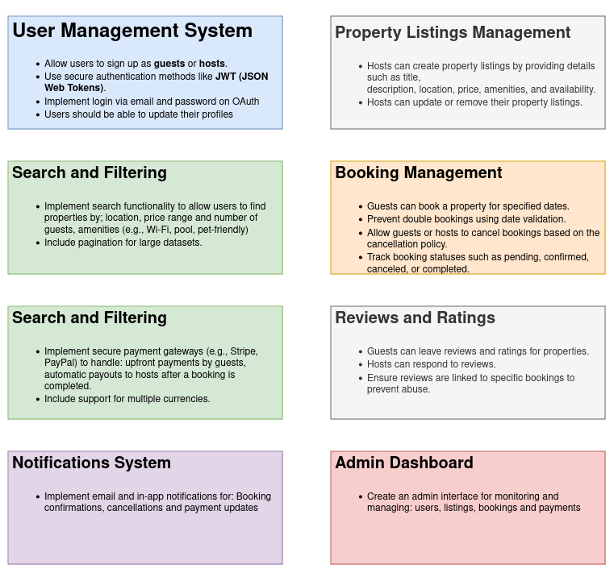

# Airbnb Clone – Features & Functionalities

This document describes the key backend features and functionalities required for the Airbnb Clone project.

## Features

### 1. User Management & Authentication
- Registration (host/guest roles)
- Login/Logout
- Password reset
- Profile management
- Role-based access

### 2. Property Management
- Add, update, delete properties
- Upload/manage images
- Set availability
- Property details

### 3. Search & Discovery
- Search properties by filters (location, price, date, amenities)
- View availability and details

### 4. Booking System
- Create/cancel bookings
- Prevent conflicts
- Booking history
- Notifications

### 5. Payment System
- Secure payment handling
- Track status (pending, completed, refunded)
- Receipts/invoices
- Multi-method support

### 6. Reviews & Ratings
- Guest reviews for properties
- Host reviews for guests
- Moderation & average ratings

### 7. Admin Features
- Manage users & properties
- Oversee bookings
- Reporting & analytics

### 8. System Features
- JWT/OAuth2 authentication
- Logging & monitoring
- Error handling
- Backup & recovery

## Diagram

Below is the high-level diagram of the system features:

